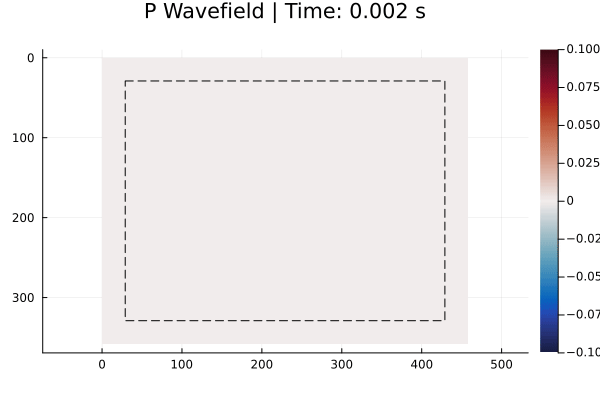

# Fomo_julia: 高阶弹性波有限差分数值模拟器

[中文文档](README_zh.md) | [English](README.md)

**Fomo_julia** 是一个基于 Julia 语言开发的高性能二维各向同性弹性波数值模拟器。它采用空间高阶交错网格有限差分方案，并集成了先进的混合吸收边界条件（HABC）。



## ✨ 核心特性

* **Backend 调度架构**：模拟逻辑**只写一遍**，CPU/GPU 切换只需改一行代码。
* **高阶交错网格 (SGFD)**：基于 Luo & Schuster (1990) 的原理，实现速度-应力场的空间交错采样，支持 **2M 阶** 空间精度。
* **混合吸收边界 (HABC)**：参考 Liu & Sen (2012) 的方案，通过单程波外推与空间权重融合，有效抑制人工边界反射。
* **自由表面模拟**：支持顶部自由表面边界条件，可精确模拟地表面波（Rayleigh waves）。
* **多格式模型 I/O**：统一加载器支持 SEG-Y、Binary、MAT、NPY、HDF5 格式，自动识别格式。
* **观测系统导出**：导出实际离散化后的震源/检波器坐标，便于偏移处理。
* **多波场视频录制**：流式视频导出，支持压力、速度幅值、vx、vz 波场。
* **CUDA 加速**：针对大规模模型性能提升显著。

---

## 🎯 v2 新特性

### 统一的 Backend 架构
```julia
# CPU/GPU 切换 - 只需改这一行！
const BACKEND = backend(:cpu)   # CPU + SIMD
const BACKEND = backend(:cuda)  # GPU 加速

# 后续代码完全相同
medium = init_medium(vp, vs, rho, dx, dz, nbc, fd_order, BACKEND)
run_shots!(BACKEND, wavefield, medium, ...)
```

### 智能模型加载器
```julia
# 根据扩展名自动识别格式
model = load_model("marmousi.jld2")                    # Julia 原生（最快）
model = load_model("model.segy"; dx=12.5)              # SEG-Y
model = load_model("vp.bin"; nx=500, nz=200, dx=10.0)  # Binary
model = load_model("model.mat"; dx=10.0)               # MATLAB

# 转换任意格式到 JLD2（推荐）
convert_model("model.segy", "model.jld2"; dx=12.5)

# 直接用于模拟
medium = init_medium(model, nbc, fd_order, BACKEND)
```

### 观测系统坐标导出（用于偏移）
```julia
# 模拟后导出实际离散化位置
results = run_shots!(...)
geom = create_geometry(results, medium, params)

# 保存为多种格式
save_geometry("survey.jld2", geom)   # Julia
save_geometry("survey.json", geom)   # Python/其他语言
save_geometry("survey.txt", geom)    # 人类可读
```

### 加载模拟结果（用于后处理）
```julia
# 加载观测系统和炮集，用于偏移
geom = load_geometry("survey.jld2")
gather = load_gather("shot_1.bin", geom.shots[1])

# 访问实际离散化位置
geom.shots[1].src_x        # 震源 X（米）
geom.shots[1].src_i        # 震源网格索引
geom.shots[1].rec_x        # 检波器 X 位置
geom.shots[1].rec_i_idx    # 检波器网格索引
```

---

## 🚀 性能说明

**任务参数（SEAM 模型）**：  
网格大小：nx = 4444, nz = 3819  
时间步数：11520  

| 运行模式 | 命令 | 用时（单炮）|
| :--- | :--- | :--- |
| **CPU** | `julia -t auto run.jl` | ≈ 35 min |
| **CUDA** | `julia run.jl`（使用 `:cuda`）| **< 3 min**（RTX 3060 12GB）|

---

## 📐 坐标系统与网格布局

**坐标约定**：
- **X**：水平方向
- **Z**：深度方向，**z=0 为地表（上边界）**

**交错网格布局**（单个网格单元内）：

| 物理量 | 偏移位置 | 说明 |
| :--- | :--- | :--- |
| `vx`, `rho_vx` | (0, 0) | 水平速度与浮力 |
| `txx`, `tzz`, `lam`, `mu_txx` | (0.5, 0) | 正应力与拉梅参数 |
| `txz`, `mu_txz` | (0, 0.5) | 剪应力与剪切模量 |
| `vz`, `rho_vz` | (0.5, 0.5) | 垂直速度与浮力 |

---

## 📦 安装指南

```bash
git clone https://github.com/Wuheng10086/Fomo_julia.git
cd Fomo_julia
julia --project=. -e 'using Pkg; Pkg.instantiate()'
```

---

## 🏃 快速开始

### 运行模拟
```bash
# 使用合成模型
julia -t auto run.jl

# 使用模型文件
julia -t auto run.jl path/to/model.jld2
```

### 转换模型格式
```bash
julia scripts/convert_model.jl model.segy model.jld2 --dx=12.5
```

### 加载模拟结果
```bash
# 查看观测系统信息
julia scripts/load_results.jl survey_geometry.jld2

# 加载观测系统 + 炮集并画图
julia scripts/load_results.jl survey_geometry.jld2 shot_1.bin shot_2.bin --plot
```

---

## 📂 项目结构

```
Fomo_julia/
├── run.jl                         # 主入口
├── scripts/
│   ├── convert_model.jl           # 模型格式转换
│   ├── load_results.jl            # 加载观测系统和炮集
│   └── plot_gather.jl             # 炮集可视化
└── src/
    ├── Elastic2D.jl               # 主模块
    ├── backends/
    │   └── backend.jl             # CPU/GPU 后端抽象
    ├── core/
    │   └── structures.jl          # 参数化数据结构
    ├── kernels/                   # 计算核心
    │   ├── velocity.jl            # 速度更新 (CPU + GPU)
    │   ├── stress.jl              # 应力更新 (CPU + GPU)
    │   ├── boundary.jl            # HABC + 自由表面
    │   └── source_receiver.jl     # 震源注入与接收
    ├── simulation/
    │   ├── time_stepper.jl        # 时间步进 + 回调
    │   └── shot_manager.jl        # 多炮管理
    ├── io/
    │   ├── output.jl              # 炮集 I/O
    │   ├── model_loader.jl        # 多格式模型加载器
    │   └── geometry_io.jl         # 观测系统坐标导出
    ├── visualization/
    │   └── video_recorder.jl      # 流式视频录制
    └── utils/
        └── init.jl                # 初始化工具
```

---

## 📁 支持的模型格式

| 格式 | 扩展名 | 必需参数 |
| :--- | :--- | :--- |
| **JLD2**（推荐） | `.jld2` | 无 |
| SEG-Y | `.segy`, `.sgy` | `dx` |
| Binary | `.bin` | `nx`, `nz`, `dx` |
| MATLAB | `.mat` | `dx` |
| NumPy | `.npy` | `dx` |
| HDF5 | `.h5`, `.hdf5` | `dx` |

**建议**：将所有模型转换为 JLD2 格式，之后使用无需任何参数！

---

## 📤 观测系统输出

观测系统导出包含**实际离散化位置**（不是原始输入值）：

```
# 示例输出 (survey.txt)
# 震源（实际离散化位置）
src_x        500.0000    # 米（由 502.3 离散化得到）
src_z        50.0000     # 米
src_i        50          # 网格索引（0-based）
src_j        5           # 网格索引（0-based）

# 检波器（实际离散化位置）
# rec_id    x(m)         z(m)      i_idx   j_idx
     1      100.0000     10.0000      10       1
     2      110.0000     10.0000      11       1
```

这确保你的偏移代码使用的是数据**真正记录位置**的坐标。

---

## 📥 加载模拟结果

使用 `scripts/load_results.jl` 或直接调用模块函数：

```julia
using .Elastic2D

# 加载观测系统
geom = load_geometry("survey_geometry.jld2")

# 用观测系统加载炮集（自动获取 nt, n_rec）
gather = load_gather("shot_1.bin", geom.shots[1])

# 多炮数据处理
for (i, shot) in enumerate(geom.shots)
    g = load_gather("shot_$i.bin", shot)
    println("Shot $(shot.shot_id): src=($(shot.src_x), $(shot.src_z))")
end
```

命令行：
```bash
julia scripts/load_results.jl survey.jld2 shot_1.bin shot_2.bin --plot
```

输出示例：
```
============================================================
  Multi-Shot Survey Geometry
============================================================
  Survey Overview:
    Number of shots: 10
    Source X range:  500.00 - 3500.00 m

  Receivers (per shot): 100
    X range:   100.00 - 3900.00 m

  Shot List:
  --------------------------------------------------------
      ID     src_x(m)     src_z(m)   src_i   src_j   n_rec
  --------------------------------------------------------
       1       500.00        50.00      50       5     100
       2       833.33        50.00      83       5     100
```

---

## 📚 学术参考

1. **交错网格原理**：  
   Luo, Y., & Schuster, G. (1990). *Parsimonious staggered grid finite-differencing of the wave equation*. Geophysical Research Letters, 17(2), 155-158.

2. **混合吸收边界条件 (HABC)**：  
   Liu, Y., & Sen, M. K. (2012). *A hybrid absorbing boundary condition for elastic staggered-grid modelling*. Geophysical Prospecting, 60(6), 1114-1132.

---

## 🤝 贡献与反馈

欢迎通过 GitHub 的 Issue 或 Pull Request 提供改进建议、报告 Bug 或分享您的模拟案例。

## 📄 许可证

本项目采用 [MIT License](LICENSE) 开源许可证。

---

**碎碎念**：谢谢老师们的指导和鼓励！  
*zswh 2025.01*

**关于名称**：**Fomo** = **FO**rward **MO**deling。虽然作者曾把它和 Fumo 玩偶记混，但这个美丽的误会给项目增添了一些趣味。🎎
