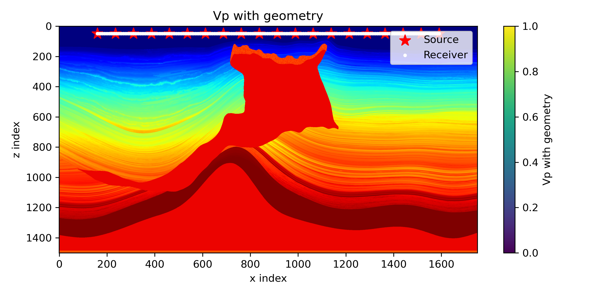
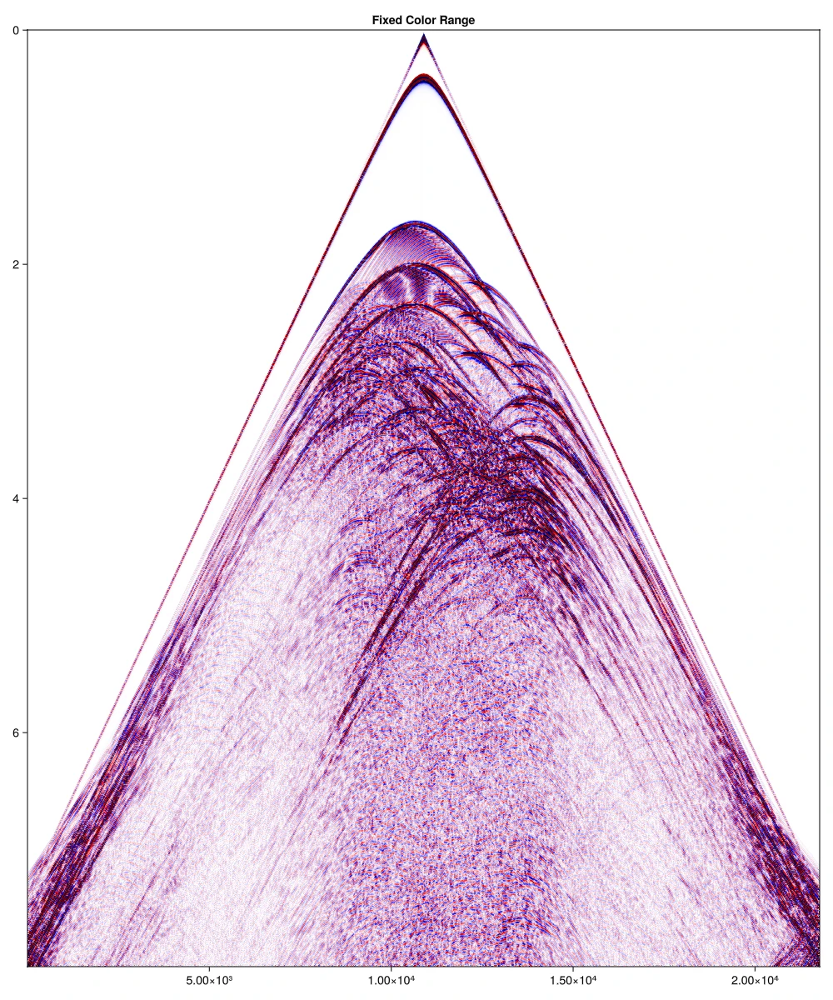

# Fomo_julia: High-Order Elastic Wave Finite-Difference Simulator

[中文文档](README_zh.md) || [English](README.md)  

**Still in development**

**Fomo_julia** is a high-performance 2D isotropic elastic wave numerical simulator developed in Julia. It employs a high-order staggered-grid finite-difference (SGFD) scheme combined with an advanced Hybrid Absorbing Boundary Condition (HABC). It provides a user-friendly interface for survey geometry setup, aiming to be an efficient and accessible tool for seismic wavefield modeling (forward modeling).


<p align="center">
  <video src="https://raw.githubusercontent.com/Wuheng10086/Fomo_julia/master/homogeneous_test.mp4" width="80%" controls autoplay loop muted></video>
</p>


https://github.com/user-attachments/assets/997ec81f-2bd0-4666-b3af-a1a02f37177f


<p align="center">
  <video src="https://raw.githubusercontent.com/Wuheng10086/Fomo_julia/master/seam_cuda_p_wave.mp4" width="80%" alt="SEAM example" controls autoplay loop muted></video>
</p>


## ✨ Core Features

* **High-order Staggered-Grid (SGFD)**: Based on the principles of Luo & Schuster (1990), implementing spatial staggered sampling for velocity-stress fields with support for **2M-order** accuracy.
* **Hybrid Absorbing Boundary (HABC)**: Following Liu & Sen (2012), it suppresses artificial reflections effectively by blending one-way wave extrapolation with two-way wave spatial weighting.
* **Free Surface Simulation**: Supports top free-surface boundary conditions, accurately modeling surface waves (Rayleigh waves).
* **Performance Optimization**: Utilizes `LoopVectorization.jl` (@tturbo) for SIMD optimization and supports multi-threading, achieving performance close to native C/Fortran code.
* **CUDA Support**: Includes a CUDA-accelerated version, providing significant speedups for large-scale models (e.g., SEAM).
* **Format Compatibility**: Native support for SEG-Y format (via SegyIO) and raw binary velocity model loading.

---

## 🚀 Performance Benchmarks

**Parameters (SEAM model)**:  
Grid size: $nx = 4444, nz = 3819$  
Time steps: $steps = 11520$

| Mode | Command / Environment | Time (Single Shot) |
| :--- | :--- | :--- |
| **CPU Performance** | `julia -t auto SEAM_example.jl` | ≈ 35 min |
| **CUDA Performance** | `julia SEAM_example_cuda.jl` | **< 3 min** (RTX 3060 12GB) |

**Model & Results**:  
  
*Vp model and survey geometry setup*

  

*Simulated shot gather*

---

## 📐 Grid Definition & Field Layout

This project strictly follows the staggered-grid definition. Within a standard grid cell $(i, j)$, the relative positions of the physical fields are as follows:

| Field | Relative Offset | Description |
| :--- | :--- | :--- |
| `vx`, `rho_vx` | $(0, 0)$ | Horizontal velocity and corresponding equivalent density |
| `txx`, `tzz`, `lam`, `mu_txx` | $(0.5, 0)$ | Normal stresses and corresponding Lame parameters |
| `txz`, `mu_txz` | $(0, 0.5)$ | Shear stress and corresponding shear modulus |
| `vz`, `rho_vz` | $(0.5, 0.5)$ | Vertical velocity and corresponding equivalent density |

> **Note**: The other three corners of the grid cell are centrosymmetric relative to the center.


---

## 📚 Academic References

The core algorithms of this project are based on the following academic literature:

1. **Staggered-Grid Principle**:
   Luo, Y., & Schuster, G. (1990). *Parsimonious staggered grid finite-differencing of the wave equation*. Geophysical Research Letters, 17(2), 155-158. [DOI: 10.1029/GL017i002p00155](https://doi.org/10.1029/GL017i002p00155)

2. **Hybrid Absorbing Boundary Condition (HABC)**:
   Liu, Y., & Sen, M. K. (2012). *A hybrid absorbing boundary condition for elastic staggered-grid modelling*. Geophysical Prospecting, 60(6), 1114-1132. [DOI: 10.1111/j.1365-2478.2011.01051.x](https://doi.org/10.1111/j.1365-2478.2011.01051.x)

---

## 📦 Installation Guide

Ensure you have [Julia](https://julialang.org/) installed. After cloning the repository, run the following in the project directory:

```bash
git clone [https://github.com/yourusername/Fomo_julia.git](https://github.com/yourusername/Fomo_julia.git)
cd Fomo_julia
julia --project=. -e 'using Pkg; Pkg.instantiate()'
```

---

---

## 📂 Project Structure

* `src/Structures.jl`: Core data structure definitions (includes Medium properties, Wavefield variables, and Survey Geometry).
* `src/Kernels.jl`: Implementation of high-order finite-difference operators and HABC core logic (the computational heart of the solver).
* `src/Solver.jl`: Manages time-stepping scheduling, source injection, and data recording.
* `src/Utils.jl`: Includes grid interpolation, SEG-Y data loading, FD coefficient calculation, and survey setup tools.  
* `src/ *[_cuda].jl`: GPU/CUDA accelerated implementations for the corresponding modules.
* `src/Elastic2D.jl`: CPU Interface
* `src/Elastic2D_cuda.jl`: CUDA Interface

* `homo_example.jl`: Homogeneous medium example
* `SEAM_example.jl`: SEAM model example (CPU)
* `SEAM_example_cuda.jl`: SEAM model example (CUDA)

## 🤝 Contributing & Feedback

Contributions via GitHub Issues or Pull Requests are welcome! Feel free to suggest improvements, report bugs, or share your simulation cases.

## 📄 License

This project is licensed under the [MIT License](LICENSE).

---
**Author's Note**: Special thanks to my teachers for their guidance and encouragement!  
*zswh 2025.12.28*

**About the Name**: The name **Fomo** is derived from the abbreviation for **FO**rward **MO**deling. Although the author once mistakenly thought it shared a name with a plushie called "Fumo," this "beautiful misunderstanding" has added a touch of dark humor to the project.  

If you are unfamiliar with what a "Fumo" is, please see the image below:  

